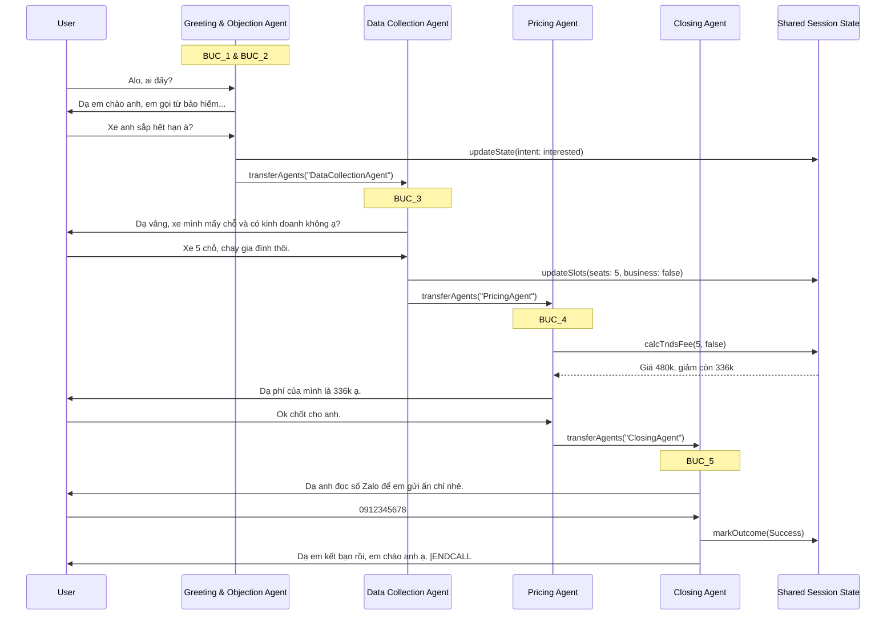

# Phân tích Kịch bản và Đề xuất Kiến trúc Multi-Agent cho Leadgen TNDS

Dựa trên việc đọc và phân tích chi tiết file kịch bản `Kịch_bản_Bot_NLP_Bảo_hiểm_TNDS_Final (1).xlsx`, dưới đây là đánh giá chuyên sâu dưới góc độ Business Analyst (BA) và đề xuất kiến trúc hệ thống.

## 1. Phân tích Kịch bản (Script Analysis)

### 1.1. Luồng chính (Main Flows & BUCs)
Kịch bản được thiết kế theo phễu bán hàng (sales funnel) chuẩn mực, chia làm 5 Business Use Cases (BUC) rõ ràng:
- **BUC_1 (Greeting & Intro):** Chào hỏi, xác nhận thông tin cơ bản (tên, biển số xe sắp hết hạn).
- **BUC_2 (Objection Handling):** Xử lý các tình huống từ chối (đã bán xe, đã mua chỗ khác, xe công ty, đang bận...). *Đây là BUC phức tạp nhất về mặt rẽ nhánh.*
- **BUC_3 (Data Collection):** Khai thác thông tin bắt buộc để tính phí (số chỗ ngồi, mục đích kinh doanh, ngày hết hạn).
- **BUC_4 (Quotation & FAQ):** Báo giá, đưa ra ưu đãi (giảm 30%, tặng quà), và xử lý các thắc mắc/lo ngại (sợ lừa đảo, so sánh giá, muốn mua ở đăng kiểm).
- **BUC_5 (Closing):** Chốt sales, xin thông tin liên hệ (Zalo), xác nhận địa chỉ giao nhận và phương thức thanh toán.

**Happy Path (Luồng lý tưởng):** BUC_1 -> BUC_3 -> BUC_4 -> BUC_5 -> End Call.

### 1.2. Các Intents chính (Key Intents)
Kịch bản bao phủ một lượng lớn intents, có thể gom nhóm:
- **Intent Nhận diện & Giao tiếp cơ bản:** Xác nhận đúng người, hỏi "gọi từ đâu", không nghe rõ, im lặng.
- **Intent Từ chối (Hard/Soft Rejections):** Xe đã bán, không dùng nữa, đã gia hạn, bận, sai số.
- **Intent Cung cấp thông tin:** Đọc số chỗ (5 chỗ, 7 chỗ), xác nhận kinh doanh/cá nhân, đọc ngày tháng.
- **Intent Thắc mắc/Nghi ngờ (FAQs):** Hỏi giá, hỏi ưu đãi, sợ lừa đảo, so sánh giá đắt/rẻ.
- **Intent Chốt đơn:** Cho số Zalo, cho địa chỉ, chọn thanh toán online/COD.

### 1.3. Đánh giá độ phức tạp (Complexity Assessment)
- **Độ phức tạp rẽ nhánh (High):** BUC_2 (Từ chối) và BUC_4 (Báo giá/FAQ) có rất nhiều nhánh rẽ. Khách hàng có thể nhảy từ BUC_4 ngược về BUC_2 (nghe giá xong chê đắt rồi từ chối).
- **Độ phức tạp trích xuất dữ liệu (Medium):** Cần bắt chính xác các entity như: Số chỗ (int), Loại xe (car/truck/pickup), Mục đích (boolean), Ngày tháng (date), Số điện thoại Zalo, Địa chỉ.
- **Độ khắt khe về câu từ (Very High):** Kịch bản yêu cầu bot phải nói *chính xác* các câu thoại đã được soạn sẵn (ví dụ: giải thích nguồn số điện thoại, giải thích uy tín để chống lừa đảo). Không được để LLM tự "bịa" ra chính sách hay giá cả.

---

## 2. Đánh giá các phương án Kiến trúc

Dựa trên tài liệu `openai-realtime-agents` và phân tích kịch bản trên, tôi đánh giá 3 phương án như sau:

### Cách 1: Single Agent + Intent Classifier (Như `leadgenTNDSVer02` cũ)
- **Cơ chế:** 1 Agent gọi tool `evaluateLeadgenTurn` liên tục. Tool này dùng rule/LLM phụ để phân loại intent, sau đó map với file kịch bản để trả về câu thoại.
- **Ưu điểm:** Kiểm soát câu từ 100% bằng code.
- **Nhược điểm (Chí mạng):** Độ trễ (Latency) quá cao. Việc gọi tool trung gian ở *mỗi lượt hội thoại* phá hỏng trải nghiệm Realtime. Code cực kỳ rối rắm (spaghetti code) giữa Prompt, Tool, Classifier và State.
- **Kết luận:** Bỏ qua. Không phù hợp cho Realtime Voicebot.

### Cách 2: Single Agent + State-Machine Prompting (Đang làm ở `leadgenV1`)
- **Cơ chế:** Nhồi toàn bộ logic BUC_1 -> BUC_5 vào 1 prompt khổng lồ.
- **Ưu điểm:** Độ trễ thấp nhất (không cần handoff). Dễ setup ban đầu.
- **Nhược điểm:** Prompt quá dài và phức tạp. Khi kịch bản có 40-50 intents (như file Excel), việc ép 1 model nhớ hết mọi rule rẽ nhánh, mọi câu thoại chính xác, và cách gọi tool update state sẽ dẫn đến hiện tượng **"Prompt Drift"** (Model bắt đầu lú lẫn, quên luật, tự bịa câu trả lời, hoặc quên gọi tool cập nhật state).
- **Kết luận:** Chỉ hợp cho kịch bản ngắn (dưới 10 intents). Với kịch bản TNDS 500 dòng Excel này, cách này sẽ sớm chạm trần (hit the ceiling) về độ ổn định.

### Cách 3: Sequential Handoffs (Multi-Agent Architecture) - ĐỀ XUẤT
- **Cơ chế:** Chia kịch bản thành các Agent chuyên biệt theo BUC. Sử dụng pattern `Sequential Handoffs` của OpenAI Agents SDK.
- **Ưu điểm:**
  - **Focus & Accuracy:** Mỗi Agent chỉ mang một prompt ngắn, tập trung xử lý cực tốt 1 khâu (ví dụ: `PricingAgent` chỉ lo tính giá và cãi nhau về giá). Model sẽ tuân thủ câu từ chuẩn xác hơn rất nhiều.
  - **Scalability:** Dễ dàng bảo trì và mở rộng. Nếu team Sales muốn đổi kịch bản chốt deal, chỉ cần sửa `ClosingAgent` mà không sợ làm hỏng luồng chào hỏi.
  - **Tool Isolation:** Mỗi Agent chỉ cầm những tool nó cần. (Ví dụ: `GreetingAgent` không cần cầm tool `calcTndsFee`).
- **Nhược điểm:** Có độ trễ nhỏ (khoảng 0.5s - 1s) khi thực hiện handoff (gọi tool `transferAgents` và update session). Tuy nhiên, với thiết kế khéo léo, ta có thể dùng câu đệm (filler words) để lấp liếm khoảng thời gian này.

---

## 3. Đề xuất Kiến trúc Multi-Agent Bài bản (The Blueprint)

Tôi đề xuất xây dựng hệ thống theo **Cách 3 (Sequential Handoffs)**. Đây là cách tiếp cận Enterprise-grade, đúng chuẩn pattern của OpenAI.

### 3.1. Sơ đồ Agents (Agent Graph)

Chúng ta sẽ chia thành 4 Agents chính:

1. **`GreetingAndObjectionAgent` (Gộp BUC_1 & BUC_2):**
   - **Nhiệm vụ:** Chào hỏi, xác nhận đúng người, xử lý các từ chối ban đầu (bận, đã bán xe, đã mua...).
   - **Handoff tới:** `DataCollectionAgent` (nếu khách đồng ý nghe tiếp), hoặc gọi tool `endCall` (nếu khách từ chối hẳn).

2. **`DataCollectionAgent` (BUC_3):**
   - **Nhiệm vụ:** Trích xuất số chỗ, mục đích sử dụng, ngày hết hạn.
   - **Handoff tới:** `PricingAgent` (khi đã gom đủ data).

3. **`PricingAgent` (BUC_4):**
   - **Nhiệm vụ:** Gọi tool `calcTndsFee`, báo giá, thuyết phục khách hàng, xử lý FAQ (sợ lừa đảo, so sánh giá).
   - **Handoff tới:** `ClosingAgent` (khi khách chốt "Ok/Đồng ý").

4. **`ClosingAgent` (BUC_5):**
   - **Nhiệm vụ:** Lấy số Zalo, chốt địa chỉ giao hàng, hướng dẫn thanh toán.
   - **Handoff tới:** Không có. Kết thúc bằng tool `markOutcome` và tag `|ENDCALL`.

### 3.2. Sơ đồ Luồng (Mermaid Diagram)

### 3.3. Quản lý State (Shared Memory)
Vì các Agent chuyển giao cho nhau, chúng cần một "bộ nhớ chung". Ta vẫn giữ lại cơ chế `inMemoryStore` (hoặc nâng cấp lên Redis) trong `sessionState.ts`.
- Khi Agent A thu thập được số chỗ, nó gọi tool `updateSlots({numSeats: 5})`.
- Khi Handoff sang Agent B, Agent B trong prompt của nó sẽ được inject cái State hiện tại này (thông qua `getLeadgenContext` tool chạy ngầm lúc khởi tạo Agent).

### 3.4. Xử lý khoảng lặng khi Handoff (Latency Mitigation)
Khi gọi `transferAgents`, hệ thống mất một chút thời gian. Để UX mượt mà:
- Trước khi handoff, Agent hiện tại phải nói một câu đệm.
- Ví dụ: `DataCollectionAgent` nói *"Dạ vâng, xe 5 chỗ cá nhân. Anh đợi em 1 giây em check hệ thống tính giá ưu đãi cho mình nhé."* -> Sau đó mới gọi tool `transferAgents("PricingAgent")`.
- `PricingAgent` lên sóng sẽ nói tiếp: *"Dạ giá của mình là..."*.

## 4. Kế hoạch Triển khai (Next Steps)

Nếu bạn đồng ý với kiến trúc Multi-Agent (Cách 3) này, tôi sẽ tiến hành:
1. Tạo thư mục `src/app/agentConfigs/leadgenMultiAgent/`.
2. Định nghĩa 4 Agents riêng biệt (`greeting.ts`, `dataCollection.ts`, `pricing.ts`, `closing.ts`).
3. Chia nhỏ file Excel kịch bản thành 4 cụm prompt tương ứng cho 4 Agents, đảm bảo "chuẩn từng câu từ".
4. Setup tool `transferAgents` để nối chúng lại thành 1 Graph.
5. Cập nhật `App.tsx` để trỏ vào scenario mới này.