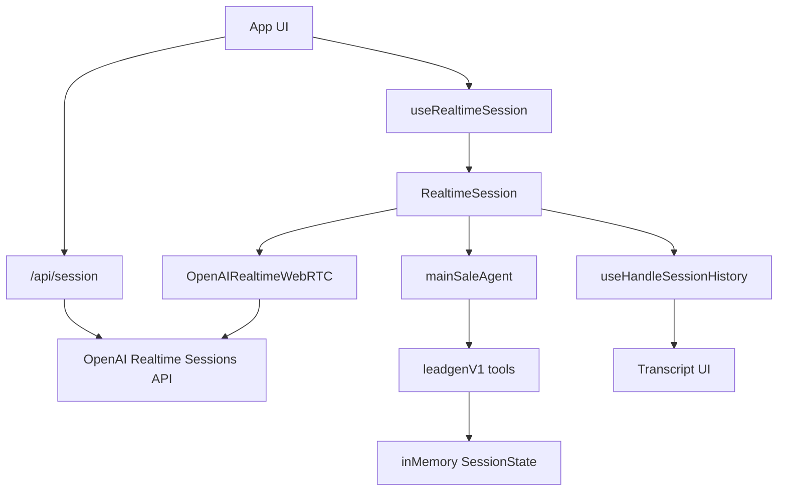
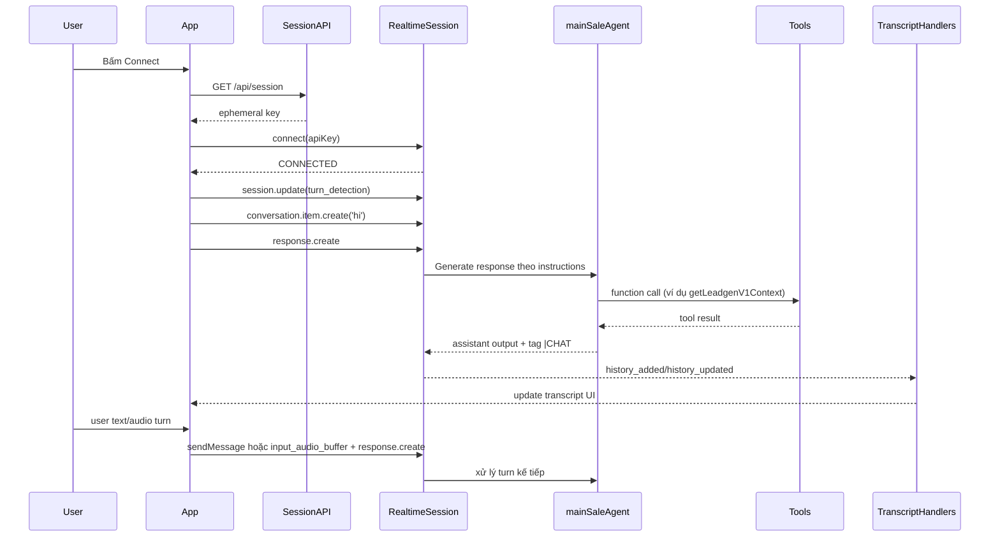

# Realtime Conversation trong Agent SDK (theo code hiện tại)

## Mục tiêu tài liệu

Tài liệu này phân tích cách hội thoại (conversation) đang được xử lý trong dự án khi dùng `@openai/agents/realtime`, tập trung vào:

- Session lifecycle
- Turn handling (text/audio/PTT/VAD)
- Event flow (history, transcript, tool, guardrail)
- Cách `mainSaleAgent` (leadgenV1) vận hành trong realtime
- Rủi ro kiến trúc và khuyến nghị

## Bức tranh tổng thể

Luồng runtime gồm 4 lớp:

1. **Frontend App**: điều khiển connect/disconnect, gửi event, bật/tắt turn detection, hiển thị transcript.
2. **Session API**: tạo ephemeral key qua Realtime Sessions API.
3. **RealtimeSession SDK**: giữ conversation realtime, xử lý tool calls, stream event.
4. **Agent + Tool + State**: xử lý nghiệp vụ leadgen và cập nhật state nội bộ.

## 1) Session lifecycle

### 1.1 Tạo ephemeral key

Server route `/api/session` gọi OpenAI Realtime Sessions API để tạo session:

- File: `src/app/api/session/route.ts`
- Model lấy từ `NEXT_PUBLIC_OPENAI_MODEL`, fallback là `gpt-4o-realtime-preview-2024-12-17`.

Điều này giúp client không cầm trực tiếp `OPENAI_API_KEY`.

### 1.2 Khởi tạo RealtimeSession ở client

Hook `useRealtimeSession` tạo:

- `RealtimeSession(rootAgent, options)`
- transport: `OpenAIRealtimeWebRTC`
- model: `process.env.NEXT_PUBLIC_OPENAI_MODEL || 'gpt-4o-mini-realtime-preview'`

File: `src/app/hooks/useRealtimeSession.ts`

Lưu ý:

- Session config đang đặt `modalities: ['text']`.
- App mute audio output từ realtime và dùng TTS service riêng.

## 2) Cách conversation turn được kích hoạt

Trong app có 4 kiểu kích hoạt turn:

### 2.1 Synthetic turn mở đầu

Sau khi connected, app có thể gửi message giả `'hi'` để ép bot chào:

- `conversation.item.create` (user message)
- rồi `response.create` (trigger model trả lời)

File: `src/app/App.tsx`

### 2.2 Text turn

Khi user nhập text:

- gọi `sendUserText(text)` từ hook.
- SDK push message vào conversation hiện tại.

### 2.3 Audio PTT turn

Khi nhấn nói:

- gửi `input_audio_buffer.clear`

Khi nhả:

- gửi `input_audio_buffer.commit`
- gửi `response.create`

File: `src/app/App.tsx`

### 2.4 Server VAD turn

App dùng `session.update` để bật/tắt `turn_detection`:

- PTT bật -> `turn_detection: null`
- PTT tắt -> `turn_detection: { type: 'server_vad', ... }`

## 3) Event handling realtime

Hook `useRealtimeSession` đăng ký listener cho các event quan trọng:

- `history_added`
- `history_updated`
- `agent_tool_start`
- `agent_tool_end`
- `guardrail_tripped`
- `transport_event` (các event transcript audio từ transport)

File: `src/app/hooks/useRealtimeSession.ts`

Hook `useHandleSessionHistory` chịu trách nhiệm map event thành dữ liệu hiển thị:

- Parse text từ `input_text`, `text`, `output_text`, `output_text_delta`, `audio.transcript`
- Update message delta/final vào transcript store
- Ghi breadcrumb cho tool call/tool result

File: `src/app/hooks/useHandleSessionHistory.ts`

## 4) Cách leadgenV1 chạy trong realtime

### 4.1 Agent root

LeadgenV1 dùng single agent:

- `mainSaleAgent`
- instructions dài theo BUC_1..BUC_5
- toolset business cho state/pricing/outcome

Files:

- `src/app/agentConfigs/leadgenV1/mainSale/mainSaleAgent.ts`
- `src/app/agentConfigs/leadgenV1/mainSale/instructions.ts`
- `src/app/agentConfigs/leadgenV1/tools.ts`

### 4.2 Prompt-driven flow

Instruction quy định:

- Mỗi lượt bắt buộc kết thúc bằng `|CHAT` hoặc `|ENDCALL`
- Không dùng `|FORWARD`
- Có rule format ngày dạng nói tự nhiên, không dùng `dd/mm/yyyy`
- Mỗi lượt phải cập nhật state bằng `updateLeadgenSessionState`

### 4.3 Tool orchestration

Bộ tool đang dùng trong leadgenV1:

- `getLeadgenV1Context`
- `updateLeadgenSessionState`
- `calcTndsFee`
- `markLeadgenOutcome`
- `createLeadOrUpdate`
- `scheduleFollowup`

Tool execution chạy local trong runtime, kết quả trả về model để model sinh câu trả lời kế tiếp.

## 5) State conversation đang nằm ở đâu

Có 3 lớp state chính:

1. **Realtime conversation history**: trong session realtime (stream event).
2. **Transcript UI state**: trong context client, build từ events.
3. **Business state leadgen**: `inMemoryStore` theo `sessionId` ở `sessionState.ts`.

File: `src/app/agentConfigs/leadgenV1/internal/sessionState.ts`

### Cơ chế merge runtime override từ FE

`setLeadgenV1RuntimeContext` nhận overrides từ query params (gender, seats, expiry, ...), sau đó:

- `getLeadgenV1State()` luôn merge override vào state hiện tại.
- Giúp FE thay đổi context mà không cần sửa logic tool.

## 6) Sequence chi tiết một phiên hội thoại điển hình

## 7) Điểm mạnh

- Tách rõ realtime transport và business tools.
- Event-driven transcript khá đầy đủ (delta + final + tool breadcrumbs).
- Prompt có luật cứng output tag (`|CHAT`/`|ENDCALL`) nên dễ downstream parse.
- Runtime context từ FE giúp test nhiều kịch bản nhanh.

## 8) Rủi ro và vấn đề cần chú ý

### 8.1 Fallback model không đồng nhất client/server

- Server fallback: `gpt-4o-realtime-preview-2024-12-17`
- Client fallback: `gpt-4o-mini-realtime-preview`

Nếu thiếu env, có thể xuất hiện behavior lệch giữa nơi tạo session và nơi khởi tạo SDK.

### 8.2 State leadgen là in-memory

`inMemoryStore` không bền vững qua restart và không share giữa instance -> rủi ro khi scale.

### 8.3 Synthetic `'hi'` là turn nhân tạo

Giúp trigger greeting ổn định nhưng làm conversation history có thêm một user turn giả.

### 8.4 Legacy block trong `tools.ts`

Cuối file `src/app/agentConfigs/leadgenV1/tools.ts` còn block comment code cũ dài (classify/policy). Không ảnh hưởng runtime nhưng dễ gây nhầm khi maintain.

## 9) Khuyến nghị kỹ thuật

1. **Chuẩn hóa fallback model** giữa server/client để giảm drift.
2. **Tách state sang storage bền vững** (Redis/DB) nếu cần multi-instance.
3. **Giữ prompt checklist cứng** cho nhánh BUC + state update để hạn chế trôi luồng.
4. **Dọn legacy comment block** trong `tools.ts` để codebase sạch hơn.
5. **Theo dõi metrics theo event**:
   - thời gian từ `response.create` đến `history_updated DONE`
   - số lần tool call/turn
   - tỷ lệ output thiếu tag (nếu có parser kiểm tra)

## 10) Kết luận

Trong kiến trúc hiện tại, conversation realtime của Agent SDK được xử lý theo mô hình:

- **WebRTC realtime transport**
- **Event-driven transcript**
- **Prompt-driven policy + local tool execution**
- **State business nội bộ theo session**

Mô hình này phù hợp để iterate nhanh kịch bản callbot. Khi cần production scale, ưu tiên xử lý trước 3 điểm: **state persistence**, **model config consistency**, và **observability theo event/turn**.
